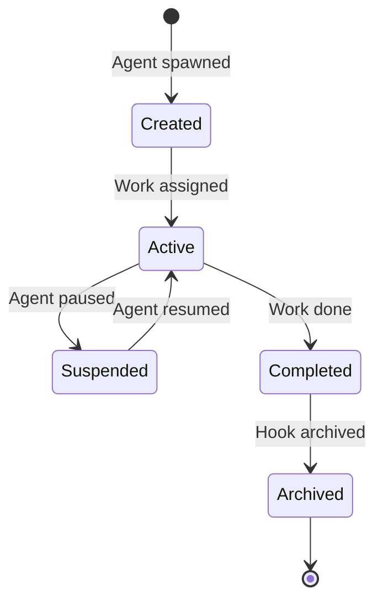

# Architectural Patterns in Steve Yegge's Agent Systems

## 1. The Propulsion Principle

### Core Concept

The Propulsion Principle is the foundational pattern enabling persistent, autonomous agent work:

> Gas Town uses **git hooks as a propulsion mechanism**. Each hook is a git worktree with:
> - **Persistent state** - Work survives agent restarts
> - **Version control** - All changes tracked in git
> - **Rollback capability** - Revert to any previous state
> - **Multi-agent coordination** - Shared through git history

### Implementation



### Hook Lifecycle States

1. **Created**: Hook initialized when agent spawned
2. **Active**: Work assigned, agent executing
3. **Suspended**: Agent paused (e.g., for handoff)
4. **Completed**: Work finished successfully
5. **Archived**: Hook preserved for history/reproducibility

### Benefits

- **Survives Crashes**: Work state in git, not agent memory
- **Version Control**: Complete audit trail of changes
- **Rollback**: Can revert to any point in history
- **Shareability**: Multiple agents can work from same hook
- **Reproducibility**: Exact state can be recreated

---

## 2. Two-Level Beads Architecture

### Problem Solved

Separates organizational coordination from project implementation work:

| Level | Location | Prefix | Purpose |
|-------|----------|--------|---------|
| **Town** | `~/gt/.beads/` | `hq-*` | Cross-rig coordination, Mayor mail, agent identity |
| **Rig** | `<rig>/mayor/rig/.beads/` | project prefix | Implementation work, MRs, project issues |

### Town-Level Beads

**Location**: `~/gt/.beads/`

**Purpose**: Organizational chain for cross-rig coordination:
- Mayor mail and messages
- Convoy coordination (batch work across rigs)
- Strategic issues and decisions
- **Town-level agent beads** (Mayor, Deacon, Boot, Dogs)
- **Role definition beads** (global templates)

**Examples**:
- `hq-mayor` - Mayor's coordination bead
- `hq-deacon` - Deacon's monitoring bead
- `hq-mayor-role` - Mayor role definition template
- `hq-convoy-auth` - Convoy for auth feature across rigs

### Rig-Level Beads

**Location**: `<rig>/.beads/`

**Purpose**: Project chain for implementation work:
- Bugs, features, tasks for the project
- Merge requests and code reviews
- Project-specific molecules
- **Rig-level agent beads** (Witness, Refinery, Polecats)

**Examples**:
- `gt-abc12` - Gastown project issue #abc12
- `gt-abc12.1` - Child task of gt-abc12
- `gt-gastown-witness` - Witness for gastown rig

### Agent Bead Storage

| Agent Type | Scope | Bead Location | Bead ID Format |
|------------|-------|---------------|----------------|
| Mayor | Town | `~/gt/.beads/` | `hq-mayor` |
| Deacon | Town | `~/gt/.beads/` | `hq-deacon` |
| Boot | Town | `~/gt/.beads/` | `hq-boot` |
| Dogs | Town | `~/gt/.beads/` | `hq-dog-<name>` |
| Witness | Rig | `<rig>/.beads/` | `<prefix>-<rig>-witness` |
| Refinery | Rig | `<rig>/.beads/` | `<prefix>-<rig>-refinery` |
| Polecats | Rig | `<rig>/.beads/` | `<prefix>-<rig>-polecat-<name>` |
| Crew | Rig | `<rig>/.beads/` | `<prefix>-<rig>-crew-<name>` |

### Role Beads

Role beads are **global templates** stored in town beads with `hq-` prefix:
- `hq-mayor-role` - Mayor role definition
- `hq-deacon-role` - Deacon role definition
- `hq-witness-role` - Witness role definition
- `hq-refinery-role` - Refinery role definition
- `hq-polecat-role` - Polecat role definition

Each agent bead references its role bead via the `role_bead` field, enabling:
- Consistent behavior across agents of same type
- Easy role updates (change template, all agents updated)
- Version control of role definitions

---

## 3. Agent Taxonomy Pattern

### Town-Level Agents (Cross-Rig Coordination)

These agents have visibility across all rigs:

| Agent | Role | Persistence | Key Responsibilities |
|-------|------|-------------|---------------------|
| **Mayor** | Global coordinator | Persistent | Cross-rig communication, escalations, orchestration |
| **Deacon** | Daemon beacon | Persistent | Heartbeats, plugins, monitoring, watchdog |
| **Boot** | Deacon watchdog | Ephemeral | Triage when Deacon is down |
| **Dogs** | Infrastructure workers | Variable | Cross-rig batch work, maintenance |

### Rig-Level Agents (Per-Project)

These agents operate within a single rig:

| Agent | Role | Persistence | Key Responsibilities |
|-------|------|-------------|---------------------|
| **Witness** | Per-rig health monitor | Persistent | Monitors polecats, stuck detection, recovery |
| **Refinery** | Merge queue processor | Persistent | Bors-style bisecting merge queue |
| **Polecats** | Worker agents | Persistent identity, ephemeral sessions | Task-specific work |
| **Crew** | Human workspaces | Persistent | User-managed development |

### Persistence Patterns

1. **Fully Persistent** (Mayor, Deacon, Witness, Refinery):
   - Always running
   - Maintains state across sessions
   - Survives restarts

2. **Persistent Identity, Ephemeral Sessions** (Polecats):
   - Permanent agent bead, CV chain, work history
   - Sessions are ephemeral - spawned for tasks, cleaned up on completion
   - Identity persists across sessions

3. **Ephemeral** (Boot):
   - Spawned on-demand
   - No persistence
   - Single-purpose execution

4. **Human-Managed** (Crew):
   - User controls lifecycle
   - Full git clones
   - Persistent workspaces

---

## 4. Molecule & Formula Pattern

### Concepts

| Term | Description | Analogy |
|------|-------------|---------|
| **Formula** | Source TOML template defining workflow steps | Recipe |
| **Protomolecule** | Frozen template ready for instantiation | Prepared ingredients |
| **Molecule** | Active workflow instance (root wisp only) | Cooking dish |
| **Wisp** | Ephemeral molecule for patrols/polecat work | Quick snack |
| **Root-only** | Only root wisp created; steps read from embedded formula | Streamlined |
| **Pour** | Formula flag; steps materialized as sub-wisps with checkpoint recovery | Full course |

### Lifecycle

```
Formula (source TOML) ─── "Ice-9"
    │
    ▼ bd cook
Protomolecule (frozen template) ─── Solid
    │
    ├─▶ bd mol pour ──▶ Mol (persistent) ─── Liquid
    │
    └─▶ bd mol wisp --root-only ──▶ Root Wisp (ephemeral) ─── Vapor
```

### Execution Modes

**Root-only wisps** (default):
- Formula steps NOT materialized as database rows
- Only single root wisp created
- Prevents wisp accumulation (~6,000+ rows/day → ~400/day)
- Steps read inline from embedded formula at prime time

**Poured wisps** (`pour = true`):
- Steps ARE materialized as sub-wisps
- Checkpoint recovery if session dies
- Completed steps remain closed
- Work resumes from last checkpoint

### When to Use Each

| Use Case | Mode | Reason |
|----------|------|--------|
| Polecat work, patrols | Root-only | High frequency, cheap steps |
| Releases, long workflows | Poured | Low frequency, expensive steps |

**Heuristic**: If you would curse losing progress after a crash, set `pour = true`.

### Example Formula

```toml
# release.formula.toml
description = "Standard release process"
formula = "release"
version = 1

[vars.version]
description = "The semantic version to release (e.g., 1.2.0)"
required = true

[[steps]]
id = "bump-version"
title = "Bump version"
description = "Run ./scripts/bump-version.sh {{version}}"

[[steps]]
id = "run-tests"
title = "Run tests"
description = "Run make test"
needs = ["bump-version"]

[[steps]]
id = "build"
title = "Build"
description = "Run make build"
needs = ["run-tests"]
```

### Agent Perspective

Agents do NOT use `bd mol current` or step-by-step tracking. Instead:

1. Run `gt prime` → Formula checklist rendered inline
2. Work through checklist in order
3. Run `gt done` (polecats) or `gt patrol report` (patrol agents)

```
**Formula Checklist** (10 steps from mol-polecat-work):

### Step 1: Load context and verify assignment
Initialize your session and understand your assignment...

### Step 2: Set up working branch
Ensure you're on a clean feature branch...
```

---

## 5. Escalation Protocol Pattern

### Purpose

Structured routing of issues when automated resolution fails.

### Severity Levels

| Level | Priority | Description | Default Route |
|-------|----------|-------------|---------------|
| **CRITICAL** | P0 (urgent) | System-threatening, immediate attention | bead + mail + email + SMS |
| **HIGH** | P1 (high) | Important blocker, needs human soon | bead + mail + email |
| **MEDIUM** | P2 (normal) | Standard escalation, human at convenience | bead + mail mayor |

### Tiered Flow

```
Agent -> gt escalate -s <SEVERITY> "description"
           |
           v
     [Deacon receives]
           |
           +-- resolves --> updates issue, re-slings work
           +-- cannot  --> forwards to Mayor
                              +-- resolves --> updates issue, re-slings
                              +-- cannot  --> forwards to Overseer --> resolves
```

### Escalation Beads

Escalation beads use `type: escalation` with structured labels:

| Label | Values | Purpose |
|-------|--------|---------|
| `severity:<level>` | MEDIUM, HIGH, CRITICAL | Current severity |
| `source:<type>:<name>` | plugin:rebuild-gt, patrol:deacon | What triggered it |
| `acknowledged:<bool>` | true, false | Has human acknowledged |
| `reescalated:<bool>` | true, false | Has been re-escalated |
| `reescalation_count:<n>` | 0, 1, 2, ... | Times re-escalated |
| `original_severity:<level>` | MEDIUM, HIGH | Initial severity |

### Stale Detection

- Unacknowledged escalations past `stale_threshold` (default: 4h) are re-escalated
- Severity bumps: MEDIUM → HIGH → CRITICAL
- Respects `max_reescalations` (default: 2)

### When to Escalate

**SHOULD escalate**:
- System errors (DB corruption, disk full, network failures)
- Security issues (unauthorized access, credential exposure)
- Unresolvable conflicts
- Ambiguous requirements
- Design decisions needing human judgment
- Stuck loops

**Should NOT escalate**:
- Normal workflow
- Recoverable errors
- Information queries answerable from context

---

## 6. Scheduler Pattern

### Problem Solved

Prevents resource exhaustion when dispatching many agents:
- API rate limits
- Memory exhaustion
- CPU overload

### Dispatch Modes

| Value | Mode | Behavior |
|-------|------|----------|
| `-1` (default) | Direct dispatch | `gt sling` dispatches immediately, near-zero overhead |
| `0` | Direct dispatch | Same as `-1` |
| `N > 0` | Deferred dispatch | `gt sling` creates sling context bead, daemon dispatches |

### Sling Context Beads

Scheduling state stored on **separate ephemeral beads**:
- Work bead is never modified by scheduler
- Sling context tracks: scheduled_at, priority, claim status
- Enables atomic claiming and dispatch

### Daemon Integration

Scheduler runs as **step 14** of daemon heartbeat (every 3 min):

```
Daemon heartbeat
    |
    +- Steps 0-13: Health checks, agent recovery, cleanup
    |
    +- Step 14: gt scheduler run (capacity-controlled dispatch)
         |
         +- Count active polecats (tmux)
         +- Query sling contexts
         +- Join with bd ready to determine unblocked beads
         +- Dispatch incrementally respecting max_polecats
```

### Smart Dispatch

Only dispatches beads that are:
1. Scheduled
2. Ready (no blockers)
3. Within capacity limits

---

## 7. Three-Tier Watchdog Pattern

### Architecture

```
Daemon (Go process) ← heartbeat every 3 min
    └── Boot (AI agent) ← intelligent triage
        └── Deacon (AI agent) ← continuous patrol
            └── Witnesses & Refineries ← per-rig agents
                └── Polecats ← worker agents
```

### Responsibilities

| Tier | Agent | Responsibility |
|------|-------|----------------|
| 1 | Daemon | Process management, heartbeat coordination |
| 2 | Boot | Checks Deacon health, triage if Deacon down |
| 3 | Deacon | Cross-rig supervision, patrol cycles |
| 4 | Witness | Per-rig monitoring, polecat health |
| 5 | Refinery | Merge queue processing |
| 6 | Polecats | Actual work execution |

### Problems View

Health state classification:

| State | Condition |
|-------|-----------|
| **GUPP Violation** | Hooked work with no progress for extended period |
| **Stalled** | Hooked work with reduced progress |
| **Zombie** | Dead tmux session |
| **Working** | Active, progressing normally |
| **Idle** | No hooked work |

Intervention: `n` to nudge, `h` to handoff

---

## 8. Hooks Management Pattern

### Purpose

Centralized context injection for all supported agents without polluting customer repos.

### Supported Agents

| Agent | Hook Mechanism | Managed File |
|-------|---------------|--------------|
| Claude Code, Gemini | `settings.json` lifecycle hooks | `<role>/.claude/settings.json` |
| OpenCode | JS plugin | `workDir/.opencode/gastown.js` |
| GitHub Copilot | JSON lifecycle hooks | `workDir/.github/hooks/gastown.json` |
| Codex, others | Startup nudge fallback | *(no file — nudge only)* |

### Merge Strategy

**Base → Role → Rig+Role** (more specific wins)

```
~/.gt/hooks-base.json              ← Shared base config (all agents)
~/.gt/hooks-overrides/
  ├── crew.json                    ← Override for all crew workers
  ├── witness.json                 ← Override for all witnesses
  ├── gastown__crew.json           ← Override for gastown crew specifically
  └── ...
```

### Lifecycle Hooks

| Hook | Event | Description |
|------|-------|-------------|
| `sessionStart` | Agent session begins | Inject context, mail check |
| `userPromptSubmitted` | User sends prompt | Pre-processing |
| `preToolUse` | Before tool execution | Safety checks |
| `sessionEnd` | Session ends | Cleanup, state save |

---

## Summary

These patterns work together to create:

1. **Persistence**: Git worktrees ensure state survives restarts
2. **Coordination**: Two-level architecture separates concerns
3. **Scalability**: Scheduler prevents resource exhaustion
4. **Reliability**: Three-tier watchdog detects and recovers failures
5. **Flexibility**: Molecule pattern supports varied workflow needs
6. **Safety**: Escalation protocol routes issues to appropriate humans
7. **Compatibility**: Hooks management supports multiple agent runtimes
